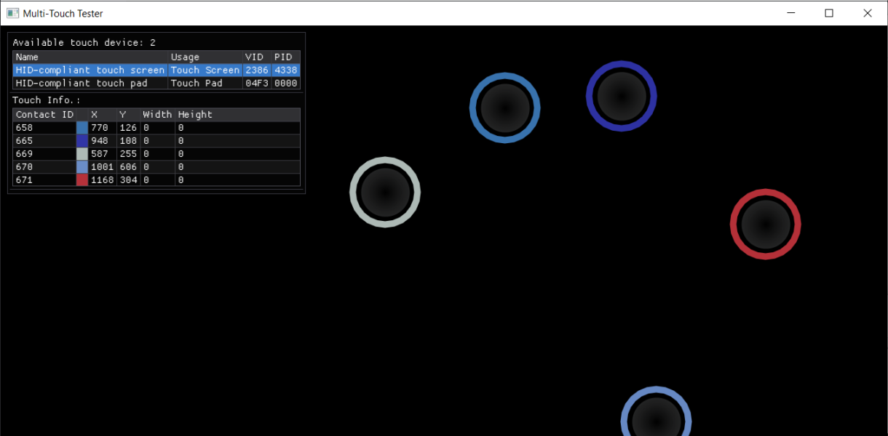

# Multi-Touch Tester

## Introduction
This simple utility visualizes the multi-touch testing.

## Feature
- List all present digitizer HID devices.
- Draw circles (valid contact area) or rings (no contact area) with random color where finger stays within utility window.
- Show contact's x/y and width/height (if supported), identified by different color.
- Highlight the touch device which touch event comes from.

## Demo

## Supported OS
Windows 7 and above.

## License
Multi-Touch Tester is licensed under the MIT License, see LICENSE.txt for more information.